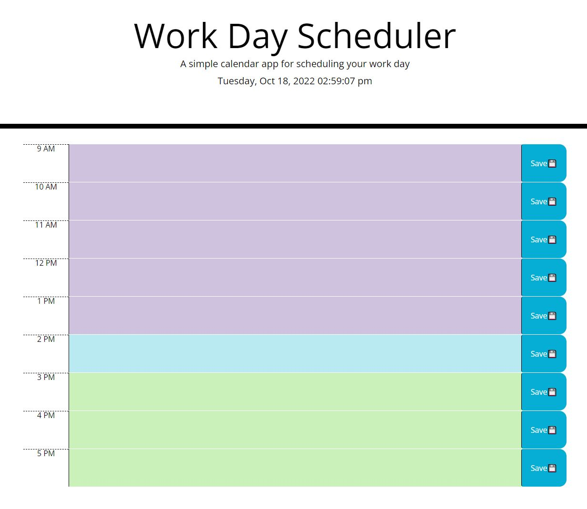

# Daily Planner

## Description
A daily work planner that will allow you to input your tasks and save them.

## Installation
N/A

## Usage
This daily work planner is a great way to keep your work day tasks organized. At the top of the page the current date and time is displayed. Below are time blocks from the hours of 9AM to 5PM, these time blocks are color coded depending on what time it is. Past tasks will display as a nice calming shade of lavender. Present tasks will display as a gentle baby blue color and future tasks will be displayed as a soothing mint green color. The tasks you input into the time blocks will save to the local storage in your browser once you click the save button to the right of the time block. You won't have to worry about accidentally closing the page and losing any of your very important daily tasks! If a task needs to be removed, just click inside the time block and backspace the task, click save again and voilà, that task is officially off your to do list. 

 

## Link To Deployed Webpage:

[Daily Planner](https://isabella-pettini.github.io/daily-planner/)

## Credits:
N/A

## License:
Please refer to the LICENSE in the repo.
